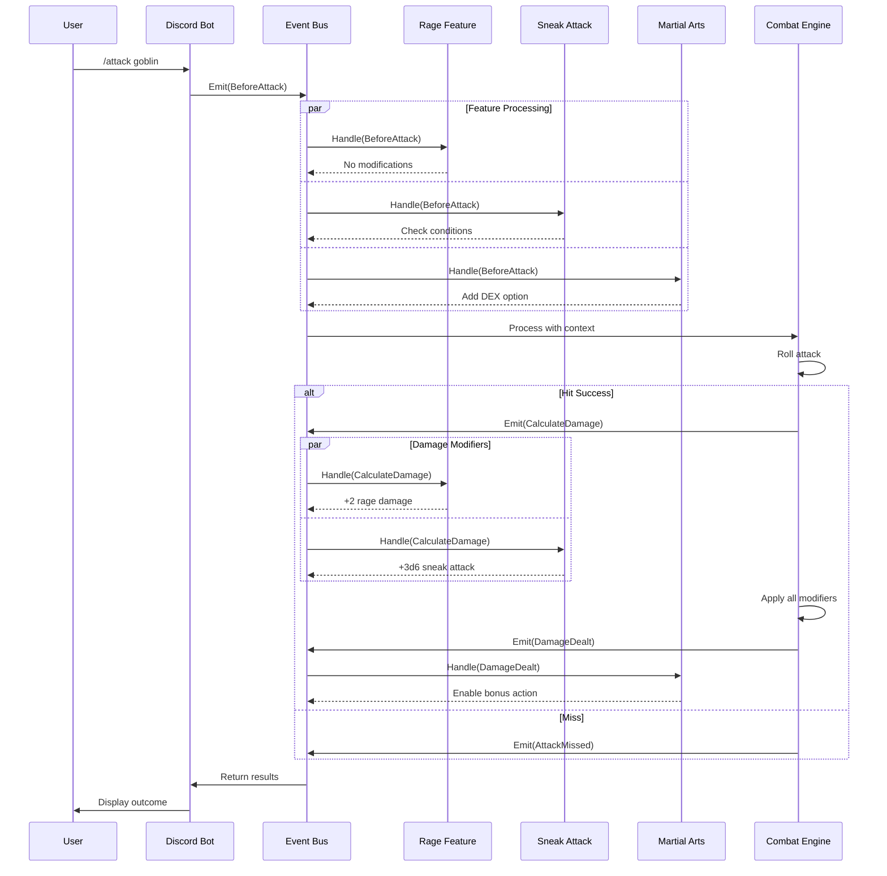
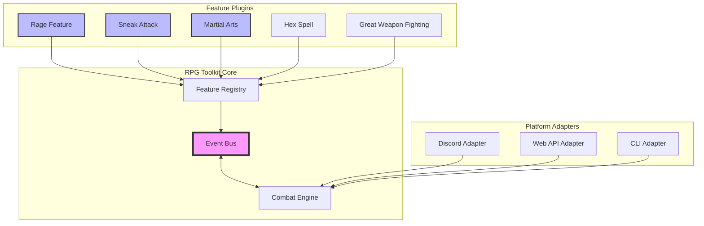
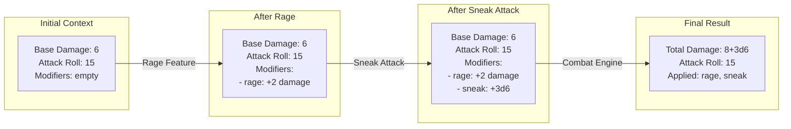
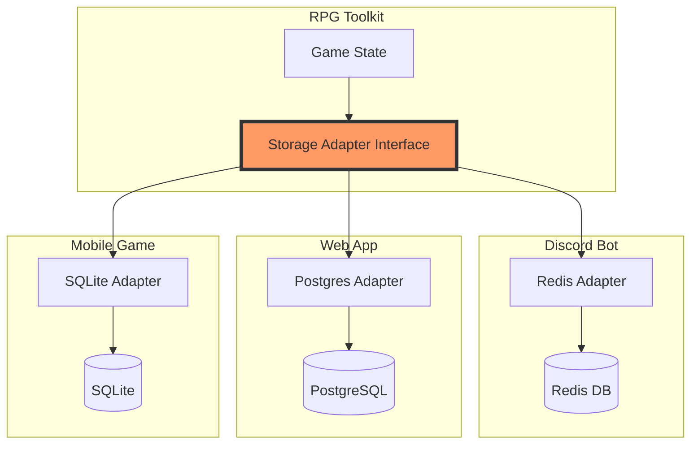

# Event Flow Visualization

## Attack Event Flow

```mermaid
sequenceDiagram
    participant U as User
    participant D as Discord Bot
    participant E as Event Bus
    participant R as Rage Feature
    participant S as Sneak Attack
    participant M as Martial Arts
    participant C as Combat Engine

    U->>D: /attack goblin
    D->>E: Emit(BeforeAttack)
    
    par Feature Processing
        E->>R: Handle(BeforeAttack)
        R-->>E: No modifications
    and
        E->>S: Handle(BeforeAttack)
        S-->>E: Check conditions
    and
        E->>M: Handle(BeforeAttack)
        M-->>E: Add DEX option
    end
    
    E->>C: Process with context
    C->>C: Roll attack
    
    alt Hit Success
        C->>E: Emit(CalculateDamage)
        
        par Damage Modifiers
            E->>R: Handle(CalculateDamage)
            R-->>E: +2 rage damage
        and
            E->>S: Handle(CalculateDamage)
            S-->>E: +3d6 sneak attack
        end
        
        C->>C: Apply all modifiers
        C->>E: Emit(DamageDealt)
        
        E->>M: Handle(DamageDealt)
        M-->>E: Enable bonus action
        
    else Miss
        C->>E: Emit(AttackMissed)
    end
    
    E->>D: Return results
    D->>U: Display outcome
```

## Feature Registration

```mermaid
graph TB
    subgraph "RPG Toolkit Core"
        EB[Event Bus]
        FR[Feature Registry]
        CE[Combat Engine]
    end
    
    subgraph "Feature Plugins"
        RF[Rage Feature]
        SF[Sneak Attack]
        MF[Martial Arts]
        HF[Hex Spell]
        GWF[Great Weapon Fighting]
    end
    
    subgraph "Platform Adapters"
        DA[Discord Adapter]
        WA[Web API Adapter]
        CA[CLI Adapter]
    end
    
    RF --> FR
    SF --> FR
    MF --> FR
    HF --> FR
    GWF --> FR
    
    FR --> EB
    EB <--> CE
    
    DA --> CE
    WA --> CE
    CA --> CE
    
    style EB fill:#f9f,stroke:#333,stroke-width:4px
    style RF fill:#bbf,stroke:#333,stroke-width:2px
    style SF fill:#bbf,stroke:#333,stroke-width:2px
    style MF fill:#bbf,stroke:#333,stroke-width:2px
```

## Event Context Mutation

```mermaid
graph LR
    subgraph "Initial Context"
        IC[Base Damage: 6<br/>Attack Roll: 15<br/>Modifiers: empty]
    end
    
    subgraph "After Rage"
        RC[Base Damage: 6<br/>Attack Roll: 15<br/>Modifiers:<br/>- rage: +2 damage]
    end
    
    subgraph "After Sneak Attack"
        SC[Base Damage: 6<br/>Attack Roll: 15<br/>Modifiers:<br/>- rage: +2 damage<br/>- sneak: +3d6]
    end
    
    subgraph "Final Result"
        FC[Total Damage: 8+3d6<br/>Attack Roll: 15<br/>Applied: rage, sneak]
    end
    
    IC -->|Rage Feature| RC
    RC -->|Sneak Attack| SC
    SC -->|Combat Engine| FC
```

## Storage Adapter Pattern

```mermaid
graph TB
    subgraph "RPG Toolkit"
        GS[Game State]
        SA[Storage Adapter Interface]
    end
    
    subgraph "Discord Bot"
        RA[Redis Adapter]
        RD[(Redis DB)]
    end
    
    subgraph "Web App"  
        PA[Postgres Adapter]
        PD[(PostgreSQL)]
    end
    
    subgraph "Mobile Game"
        SA2[SQLite Adapter]
        SD[(SQLite)]
    end
    
    GS --> SA
    SA --> RA
    SA --> PA
    SA --> SA2
    
    RA --> RD
    PA --> PD
    SA2 --> SD
    
    style SA fill:#f96,stroke:#333,stroke-width:4px
```